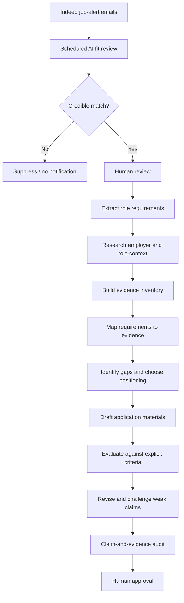

# Evidence-Driven AI Job Search & Application Workflow

A human-in-the-loop workflow for reducing job-search noise, identifying genuinely relevant roles, and developing applications from verifiable evidence rather than unsupported claims.

> **Core principle:** optimise for genuine fit and defensible evidence, not for making the candidate appear suitable at any cost.

## 60-second overview

I built this process around two recurring problems:

1. **Job discovery is noisy.** Interesting roles do not always have predictable titles, while manually checking every job alert is repetitive.
2. **Application evidence is fragmented.** Relevant evidence can be spread across career history, qualifications, GitHub projects, employer research and the vacancy itself.

The workflow therefore has two deliberately different levels of automation:

- **Discovery:** a scheduled AI task reviews new Indeed job-alert emails, assesses vacancies against career-fit criteria defined before any individual application, avoids repeats and surfaces credible matches for human review.
- **Application:** once I decide a role is worth pursuing, AI assists with requirement extraction, research synthesis, evidence mapping, drafting and critique, while higher-stakes decisions about claims, positioning and submission remain human-controlled.

The objective is not to automate applying for jobs. It is to automate low-value checking while making the higher-value reasoning **more evidence-driven and auditable**.

## Workflow



More detail: [architecture](docs/architecture.md) · [job-fit screening](docs/job-fit-screening.md)

## Worked example: Morgan & Morgan Business and Technology

One role surfaced through the wider process: **AI / Automation Engineer at Morgan & Morgan Business and Technology, Cross Hands, Carmarthenshire**.

It was an unusually strong match to signals that had already been defined in the screening workflow rather than criteria invented after seeing the vacancy.

| Pre-existing fit signal | Role requirement / context |
|---|---|
| Automation and process improvement | Remove repetitive manual work and build automated workflows |
| Applied AI | Build AI-driven solutions using multiple AI platforms |
| Practical implementation | Take business problems through to working solutions |
| Testing and troubleshooting | Test outputs, investigate failures and improve reliability |
| Learning unfamiliar technology | Learn the company's stack and client environments |
| Communication and documentation | Scope, document, hand over and explain completed work |

That triggered the second stage of the workflow: requirement extraction, employer research, GitHub review, evidence mapping, project selection, CV restructuring, cover-letter iteration and final factual QA.

The resulting evidence matrix deliberately included both strengths and gaps. For example, I could evidence n8n/OpenAI workflow work, scripting, testing, APIs/webhooks, documentation and user support; I could **not** evidence meaningful hands-on experience with Power Automate, Entra, Intune or Copilot Studio, so those remained development areas rather than being inflated into experience.

Read the full [Morgan & Morgan worked example](docs/worked-example-morgan-and-morgan.md).

## Evidence and claim controls

The application stage uses a simple source hierarchy:

| Source | Authority |
|---|---|
| Job advert | Role requirements |
| Employer research | Business and role context |
| Detailed career history | Employment claims |
| Qualification certificate | Exact qualification claims |
| GitHub repositories | Project and implementation evidence |
| My own input | Motivation and first-person judgement |

Important controls include:

- exposure does not become expertise;
- portfolio work does not become commercial experience;
- a prototype does not become a production system;
- learning does not become certification;
- fact and inference are kept separate;
- AI-assisted development is not presented as wholly unaided authorship;
- unsupported claims are revised, qualified or removed.

See [evidence and claim controls](docs/evidence-and-claim-controls.md) and the [example evidence matrix](examples/evidence-matrix.example.md).

## Human-in-the-loop design

I use AI heavily for retrieval, classification, comparison, summarisation, critique and structured iteration. I do not treat it as the final authority.

I retain responsibility for deciding:

- whether a role is genuinely worth pursuing;
- what evidence is relevant;
- whether a claim is fair and defensible;
- whether an inference belongs in the application;
- whether the writing sounds like me;
- whether the final application should be submitted.

This matters because polished output can still be wrong: it can foreground weak evidence, sound generic, conceal a genuine gap or imply experience I would not be able to defend in an interview.

## What is actually automated?

The discovery stage is implemented as a **scheduled AI task** reviewing new Indeed alert emails in my connected mailbox against a defined set of ranking signals. It deduplicates previously surfaced roles and only notifies me when a credible match appears.

The deeper application stage is intentionally more manual. The closer the workflow gets to high-stakes claims about experience, authorship or suitability, the more human judgement is retained.

This project does **not** auto-submit applications, mass-apply to vacancies, invent missing experience or claim that the full process is autonomous.

## Related technical evidence

This repository demonstrates my approach to an ambiguous information-and-decision workflow. It is not intended to substitute for my technical portfolio.

My most directly relevant automation project is [AI-Assisted Submission-Scope Guidance](https://github.com/jdohertydev/ai-assisted-submission-scope-guidance), an n8n/OpenAI workflow built around deterministic validation, constrained model judgement, structured-output checking, human review, failure handling, testing and documentation.

## Repository map

```text
README.md
docs/
├── architecture.md
├── job-fit-screening.md
├── evidence-and-claim-controls.md
├── worked-example-morgan-and-morgan.md
└── lessons-and-limitations.md
examples/
├── job-fit-criteria.example.md
└── evidence-matrix.example.md
```

## Disclosure

I used ChatGPT extensively as an AI assistant while developing this workflow and case study. I defined the problem, supplied and selected the source material, set the constraints, made the application decisions, challenged outputs, verified claims, chose what to publish and retained final editorial control.

This is a personal project. It is not affiliated with, endorsed by, or produced for Morgan & Morgan Business and Technology, Indeed, OpenAI or any other organisation mentioned here.
