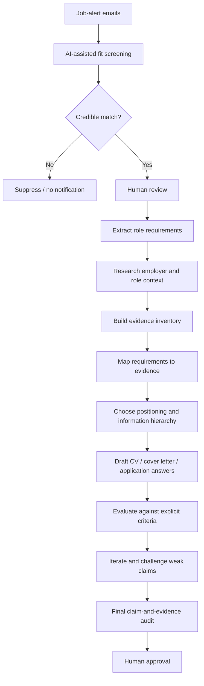

# Evidence-Driven AI Job Search & Application Workflow

A human-in-the-loop case study for using AI to reduce job-search noise, identify genuinely relevant roles, and build applications from verifiable evidence rather than unsupported claims.

> **Core principle:** optimise for genuine fit and defensible evidence, not for making the candidate appear suitable at any cost.

## Why I built this

Job alerts create two linked problems.

First, **discovery is noisy**. Job titles are inconsistent, interesting roles can sit outside an obvious career path, and manually opening every alert is repetitive. Simple keyword filters can also hide unusual but relevant opportunities.

Second, once a promising role appears, **application evidence is fragmented** across career history, qualifications, GitHub projects, employer research and the vacancy itself. The challenge is not simply writing persuasive text; it is deciding what is relevant, what can be evidenced, what remains a gap, and what should not be claimed.

I developed this workflow to make both stages more systematic while keeping the important decisions with the human.

## Workflow



## Stage 1 — job discovery and fit screening

A scheduled workflow reviews new Indeed job-alert emails and assesses the vacancies against career-fit signals I defined before any individual application.

The current screening logic gives positive weight to work involving areas such as:

- applied AI and automation;
- workflow and process improvement;
- practical problem-solving with technology;
- digital products and implementation;
- troubleshooting and systems improvement;
- educational technology and AI enablement;
- meaningful autonomy and real responsibility.

It down-ranks roles dominated by repetitive administration, generic customer service, aggressive sales, pure classroom teaching, heavy supervision, or work with little connection to technology or systems improvement.

The automation also avoids repeatedly surfacing the same vacancy and only notifies me when at least one role appears to be a credible fit.

The screening is deliberately **advisory**. It reduces noise; it does not decide whether I apply.

See [docs/job-fit-screening.md](docs/job-fit-screening.md).

## Stage 2 — evidence-grounded application development

Once I choose to investigate a vacancy, the workflow changes from discovery to evidence control.

I use a source hierarchy so that each type of claim has an appropriate authority:

| Source | Primary purpose |
|---|---|
| Job advert | Role requirements and employer-stated criteria |
| Employer research | Business context, culture and likely role environment |
| Detailed career history | Employment and responsibility claims |
| Qualification certificate | Exact qualification wording and result |
| GitHub repositories | Project, technology, testing and implementation evidence |
| My own input | Motivation, preferences and first-person judgement |

The central rule is simple: **if a claim cannot be supported, it is revised, qualified or removed.**

Examples:

- project work must not be presented as commercial experience;
- exposure must not become expertise;
- learning must not become certification;
- a prototype must not become a production system;
- AI-assisted development must not be presented as wholly unaided authorship.

See [docs/evidence-and-claim-controls.md](docs/evidence-and-claim-controls.md).

## Worked example — Morgan & Morgan Business and Technology

One vacancy surfaced during this wider process: **AI / Automation Engineer at Morgan & Morgan Business and Technology in Cross Hands, Carmarthenshire**.

It stood out because the role closely matched criteria that had already been defined in the job-screening workflow: practical automation, improving repetitive processes, AI-assisted workflows, testing, troubleshooting, documentation, communication and willingness to learn unfamiliar tools.

I then used the application workflow to:

1. extract the role requirements;
2. research the employer and distinguish verified facts from inference;
3. inspect my public GitHub evidence;
4. map requirements against career and project evidence;
5. identify genuine gaps rather than hide them;
6. choose which projects best demonstrated fit;
7. restructure the CV around the strongest evidence;
8. draft and repeatedly critique the cover letter against explicit criteria;
9. audit important claims before submission.

The worked example is documented in [docs/worked-example-morgan-and-morgan.md](docs/worked-example-morgan-and-morgan.md).

## Human-in-the-loop controls

AI is useful here for retrieval, comparison, classification, summarisation, critique and structured iteration. I do not treat it as the final authority.

Human decisions remain responsible for:

- whether a vacancy is genuinely worth pursuing;
- which evidence is relevant;
- whether a claim is fair and defensible;
- whether an inference should appear at all;
- what tone sounds like me;
- whether the final application is submitted.

This became especially important during drafting. A polished paragraph could still be the wrong paragraph if it was too generic, foregrounded the wrong evidence, sounded unlike me, or implied more experience than I could defend in an interview.

## What this repository is — and is not

This is a **documented AI-assisted workflow**, not a claim that the entire job-search or application process is fully automated.

The current discovery stage is scheduled and partially automated. The deeper application stage is intentionally more manual because it contains higher-stakes judgement about evidence, positioning and authorship.

It also does **not** auto-submit applications, invent missing experience, mass-apply to vacancies, or optimise documents by keyword stuffing.

## Repository structure

```text
README.md
docs/
├── architecture.md
├── job-fit-screening.md
├── evidence-and-claim-controls.md
├── worked-example-morgan-and-morgan.md
└── lessons-and-limitations.md
examples/
├── job-fit-criteria.example.md
└── evidence-matrix.example.md
```

## What I learned

The most useful part of AI in this workflow has not been first-draft generation. It has been the ability to repeatedly ask:

- What is the actual problem?
- What evidence supports this claim?
- What am I overlooking because of an old job title?
- Which requirement matters most?
- What is fact and what is inference?
- Does this wording survive challenge?
- Is this stronger because it is more persuasive, or only because it sounds more impressive?

Those questions make the workflow slower than one-click application generation, but much more useful to me.

See [docs/lessons-and-limitations.md](docs/lessons-and-limitations.md).

## Disclosure

I used ChatGPT extensively as an AI assistant while developing the workflow and this case study. I defined the problem, supplied and selected the source material, set the constraints, made the application decisions, challenged outputs, verified claims, chose what to publish and retained final editorial control.

This is a personal project. It is not affiliated with, endorsed by, or produced for Morgan & Morgan Business and Technology, Indeed, OpenAI or any other organisation mentioned in the case study.
