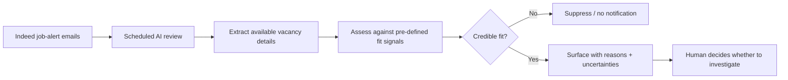
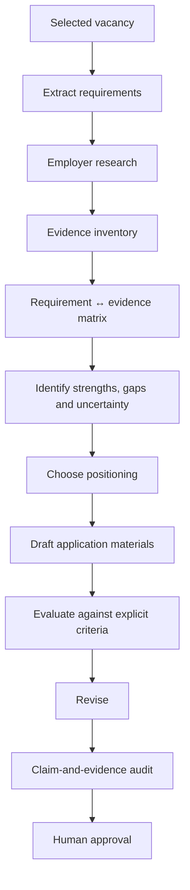

# Architecture

This project has two linked stages: **job discovery** and **application development**. The architecture deliberately increases human involvement as the consequences of an error become more significant.

## 1. Discovery layer

The discovery layer exists to reduce repetitive checking and improve signal-to-noise. It is not intended to make the final career decision.

### Current implementation boundary

The scheduled review is a **ChatGPT task connected to my mailbox**, not a standalone service that I coded and deployed. The public repository documents the workflow design and decision logic accurately rather than presenting the orchestration as custom software.

Key controls:

- fit criteria are defined independently of any one vacancy;
- positive and negative signals are ranking factors, not absolute rules;
- previously surfaced roles are not intentionally repeated;
- uncertainty is retained when an email alert contains incomplete information;
- a human decides whether a surfaced role deserves deeper investigation.

## 2. Application layer

The application stage is intentionally less automated. The closer the process gets to a high-stakes claim about experience, authorship or suitability, the more human judgement is retained.

## Automation gradient

| Stage | AI / automation role | Main failure risk | Human control |
|---|---|---|---|
| Alert checking | Scheduled retrieval and triage | Missing or mis-ranking a role | Review surfaced roles |
| Fit assessment | Compare vacancy signals with defined criteria | False confidence from incomplete alert data | Decide whether to investigate |
| Requirement extraction | Structure the advert | Omitting nuance | Check against source advert |
| Employer research | Summarise and compare public information | Treating inference as fact | Verify important claims |
| Evidence mapping | Retrieve and connect relevant evidence | Overstating similarity | Approve claim/evidence links |
| Drafting | Generate and revise alternatives | Fluent but inflated wording | Accept, reject or rewrite |
| Final QA | Challenge claims against rules | Missed unsupported statement | Final submission decision |

## Design principle: graduated automation

The system follows three rules:

1. **Automate repetitive retrieval and filtering where errors are recoverable.**
2. **Use AI to accelerate comparison, synthesis and critique where source checking is possible.**
3. **Keep consequential claims and submission decisions human-controlled.**

This avoids a false choice between doing everything manually and delegating the entire application to an autonomous agent.
