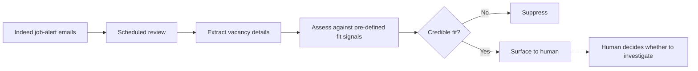
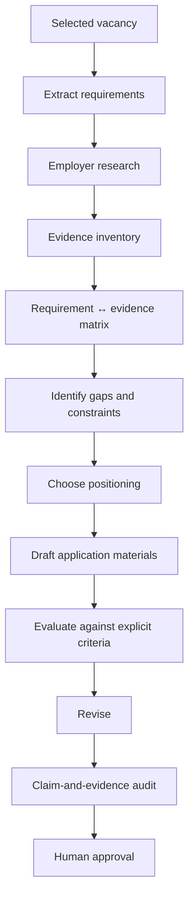

# Architecture

This project has two linked stages: **job discovery** and **application development**.

## 1. Discovery layer

The discovery layer exists to reduce repetitive checking and improve signal-to-noise. It is not intended to make the final career decision.

Key controls:

- fit criteria are defined independently of any one vacancy;
- positive and negative signals are treated as ranking factors, not absolute rules;
- weak matches are not repeatedly surfaced;
- duplicate vacancies are avoided where possible;
- a human decides whether a surfaced role deserves deeper investigation.

## 2. Application layer

The application stage is intentionally less automated. The closer the process gets to a high-stakes claim about experience, authorship or suitability, the more human judgement is retained.

## Design principle

The system is designed around **graduated automation**:

- automate repetitive discovery;
- use AI to accelerate research, comparison and critique;
- keep evidence interpretation and final application decisions human-controlled.

This avoids a false choice between doing everything manually and delegating the entire application to an AI model.
